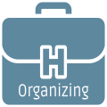

# HackOrganizing

A list of needs, lists, tips and helpful resources to organize and run a Hackathon.

[edit](https://github.com/hack-tools/hackorganizing/edit/master/README.md)

---

**Table of Contents**
* [Organization and Process](#organization-and-process)
* [Attendees](#attendees)
* [Sponsors](#sponsors)
* [Marketing and Communication](#marketing-and-communication)
* [Food and drinks](#food-and-drinks)
* [Infrastructure](#infrastructure)
* [Several](#several)
* [Templates](#templates)
* [Similar resources](#similar-resources)

---

## Organization and Process
- Theme (topic and helpful resources)
- Set Badget
- Schedule (registration, hacking days, presentations, results)
- Location and space
- Dates and deadlines per task
- Presentations guide and rules
- Evaluation criteria
- Code of conduct and rules
- Legal terms
- Prizes
- Submission requirements
- Mentoring needs
- Help desk and online help (eg slack channel)
- Online form to submit reviews, instant online results
- Related talks and presentation (before the event)
- Reception
- Take photos and videos

## Attendees
- Attendees (limit, requirements, emails)
- Team/Attendee registration form
- Swags
- T-shirts
- Badges and stickers
- Event IDs
- After event Feedback form

## Sponsors
- Payments
- Invoices
- What we offer (short list on pdf)
- Pre-hackathon talks (how to, when, duration, location)
- Bring your promotional stuff
- Material for posters, website and media (eg logo, short description and links)
- Sponsor emails

## Marketing and Communication
- Branding (logo, graphics, banners, colors)
- Website
- Google Analytics
- Poster
- Media partners
- Media announcement
- Media kit (about the event pdf, logos and links)
- Social media (twitter, FB)
- Email campaign & newsletter
- Contact lists of attendees
- After event media announcement
- After event statistics
- After event outcome and thank you email to Sponsors
- After event outcome and thank you email to Teams
- Submit the event on lists (eg [Hackalist](http://www.hackalist.org))

## Food and drinks
- Food
- Drinks
- Coffee
- Water
- Refrigerator
- Plastic cups
- Knifes, forks, spoons
- Sugar, salt etc

## Infrastructure
- Projector
- Wifi and Internet connection
- Heating/Air Condition
- Desks
- Chairs
- Hight spped internet wifi
- Cables, plugs etc

## Several
- Plugs
- Soap
- Toilet paper
- White paper (blank pages)

## Templates
- [Download task lists templates](https://github.com/hack-tools/hackorganizing/raw/master/task_templates.zip)

## Similar resources
- [hackathon.guide](https://hackathon.guide)
- [guide.mlh.io](https://guide.mlh.io)
- [meganesu.github.io/hackathon-guide](https://meganesu.github.io/hackathon-guide)
- [kinlane/hack-weekends-guide](https://github.com/kinlane/hack-weekends-guide)
- [cconsidine/awesome-hackathons](https://github.com/cconsidine/awesome-hackathons)
- [ghmeier.github.io/hackathon-planning-guide](http://ghmeier.github.io/hackathon-planning-guide)

